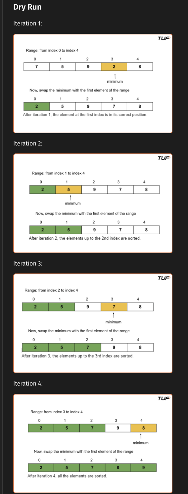
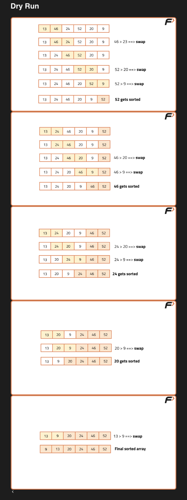

# Sorting

- [Sorting](#sorting)
  - [Selection Sort](#selection-sort)
    - [Algorithm](#algorithm)
    - [Time Complexity](#time-complexity)
  - [Bubble Sort](#bubble-sort)
    - [Algorithm](#algorithm-1)
    - [Time Complexity](#time-complexity-1)
  - [Insertion Sort](#insertion-sort)
  - [Algorithm](#algorithm-2)
    - [Time Complexity](#time-complexity-2)

## Selection Sort 

>[!IMPORTANT]
**Pushes the minimum element to the left.**

### Algorithm 
- First, we will select the range of the unsorted array using a loop (say i) that indicates the starting index of the range. The loop will run forward from 0 to n-1. The value i = 0 means the range is from 0 to n-1, and similarly, i = 1 means the range is from 1 to n-1, and so on. (Initially, the range will be the whole array starting from the first index.)
- Now, in each iteration, we will select the minimum element from the range of the unsorted array using an inner loop.
- After that, we will swap the minimum element with the first element of the selected range(in step 1).
- After i iterations, we will find that the array is sorted up to the first i elements ( i-1 ) index
- Hence, after n-1 iterations, the array is sorted



```cpp
int n, m, tmp; cin>>n;
vector<int> a(n);
for (int i=0; i<n; i++) cin>>a[i]; // taking input

for (int i=0; i<n-1; i++) { // outer loop (upper limit till n-1 because last element is already sorted )
    m = i;
    for (int j=i+1; j<n; j++) { // inner loop finding min of unsorted array
        if (a[j]<a[m]) m = j;
    }
    tmp = a[m]; a[m] = a[i]; a[i] = tmp; // swapping current element with min element in unsorted part
}

for (int i=0; i<n; i++) cout<<a[i]<<" "; // output
```

### Time Complexity

- The inner loop runs for n-1 times for i=0; n-2 times for i=1; n-3 times for i=2 ... 
- Hence, it makes approximately **n(n-1)/2 comparisions** (sum of 1 to n-1)
- **Time Complexity = O(N²)** ( Ignored constants and lower powers )

## Bubble Sort

>[!IMPORTANT]
**Pushes the maximum element to the right by adjacently comparing and swapping.**

### Algorithm
- **Select the range of the unsorted array:** Use an outer loop (i) that runs backward from n-1 to 1 (where n is the size of the array). The value i = n-1 means the range is from 0 to n-1, i = n-2 means the range is from 0 to n-2, and so on.
- **Push the maximum element to the end of the selected range:** Use an inner loop (j) that runs from 0 to i-1. Compare adjacent elements and swap them if arr[j] > arr[j+1]. Repeating this process ensures the maximum element in the current range moves to index i.
- **Progressively sort the array:** After each outer loop iteration, the last part of the array becomes sorted. For example:
After the first iteration, the element at the last index is sorted.
After the second iteration, the last two elements are sorted.
This continues until the entire array is sorted.
- **Complete sorting:** After n-1 iterations, the whole array will be sorted.

>[!NOTE]
After each iteration, the sorted portion grows from the end, so the last index of the unsorted range decreases by 1 (controlled by i). The inner loop (j) ensures the maximum element in the range [0…i] is placed at index i.



```cpp
int n, tmp; cin>>n;
vector<int> a(n);
for (int i=0; i<n; i++) cin>>a[i]; // taking input

// first we need to go from 0->n-1, then 0->n-2 ... 0->1; i goes from n-1 to 1; after i'th iteration, max element will be at i'th index
for (int i=n-1; i>=1; i--) { 
    int didSwap = 0;
    for (int j=0; j<=i-1; j++) { // j goes from 0 to i-1, we compare j and j+1 terms so j should be one less than i at max
        if (a[j]>a[j+1]) { tmp = a[j+1]; a[j+1] = a[j]; a[j] = tmp; didSwap=1; } // swapping adjacent elements to get the max to the right
    }
    if (didSwap==0) break; // if no swap occured, break the loop (array is already sorted), finishes in O(N)
}

for (int i=0; i<n; i++) cout<<a[i]<<" "; // output
```

### Time Complexity

- O(N^2) for the worst, and average cases.
- The best case occurs if the given array is already sorted. We reduce the best time complexity to O(N) by just adding a small check inside the loops.
- We will check in the first iteration if any swap is taking place. If the array is already sorted no swap will occur and we will break out from the loops.

## Insertion Sort

>[!IMPORTANT]
Takes each element and puts it in its correct position ( till that part of the array )

## Algorithm

- In each iteration, select an element from the unsorted part of the array using an outer loop.
- Place this selected element in its correct position within the sorted part of the array.
- Use an inner loop to shift the remaining elements, if necessary, to accommodate the selected element. This involves shifting elements by one position until the selected element can be placed in the correct position.
Continue this process until the entire array is sorted.

```cpp
int n, tmp; cin>>n;
vector<int> a(n);

for (int i=0; i<n; i++) cin>>a[i];

for (int i=0; i<n; i++) { // i goes from 0 to n-1 ( last element )
    int j=i;
    while ( j>0 && a[j-1]>a[j] ) { // previous element is greater, swap and decrement j
        tmp = a[j-1]; a[j-1] = a[j]; a[j] = tmp;
        j--; 
    }
}

for (int i=0; i<n; i++) cout<<a[i]<<" "; // output
```

### Time Complexity
- Worst Case: O(N^2), Best Case: O(N) (No swap happens, inner while loop always false)