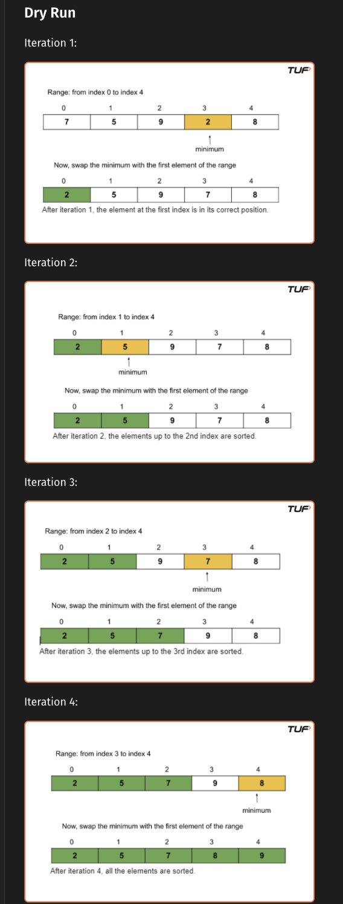
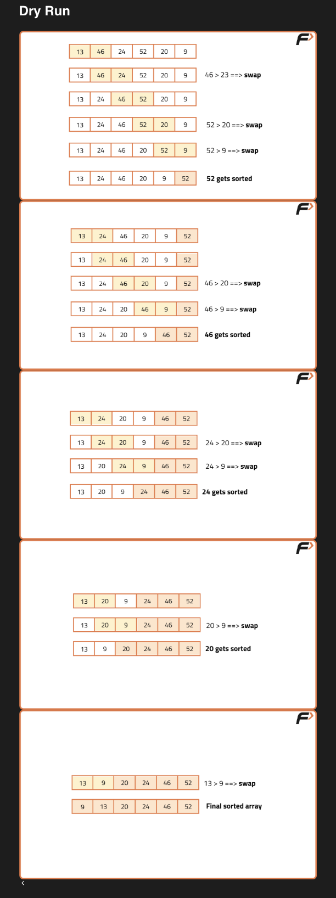
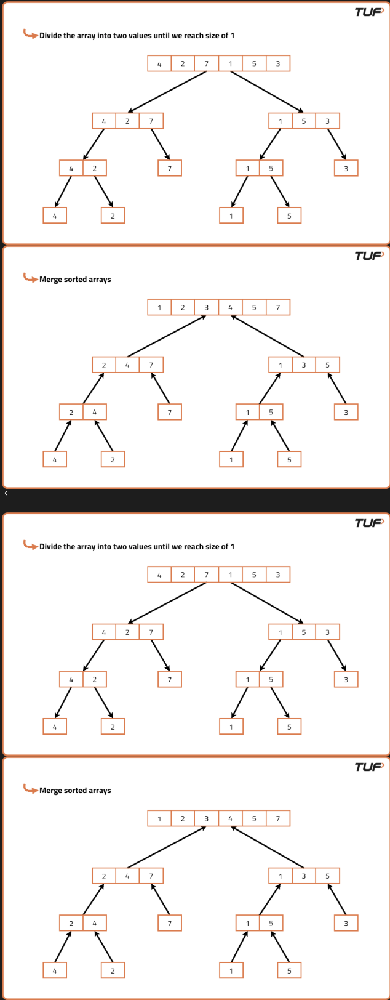
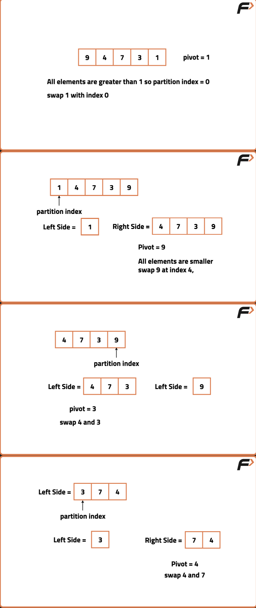

# Sorting

- [Sorting](#sorting)
  - [Selection Sort](#selection-sort)
    - [Algorithm](#algorithm)
    - [Time Complexity](#time-complexity)
  - [Bubble Sort](#bubble-sort)
    - [Algorithm](#algorithm-1)
    - [Time Complexity](#time-complexity-1)
  - [Insertion Sort](#insertion-sort)
  - [Algorithm](#algorithm-2)
    - [Time Complexity](#time-complexity-2)
  - [Merge Sort](#merge-sort)
    - [Algorithm](#algorithm-3)
    - [Time and Space Complexity](#time-and-space-complexity)
  - [Quick Sort](#quick-sort)
    - [Algorithm](#algorithm-4)
    - [Time and Space Complexity](#time-and-space-complexity-1)

## Selection Sort 

>[!IMPORTANT]
**Pushes the minimum element to the left.**

### Algorithm 
- First, we will select the range of the unsorted array using a loop (say i) that indicates the starting index of the range. The loop will run forward from 0 to n-1. The value i = 0 means the range is from 0 to n-1, and similarly, i = 1 means the range is from 1 to n-1, and so on. (Initially, the range will be the whole array starting from the first index.)
- Now, in each iteration, we will select the minimum element from the range of the unsorted array using an inner loop.
- After that, we will swap the minimum element with the first element of the selected range(in step 1).
- After i iterations, we will find that the array is sorted up to the first i elements ( i-1 ) index
- Hence, after n-1 iterations, the array is sorted



```cpp
int n, m, tmp; cin>>n;
vector<int> a(n);
for (int i=0; i<n; i++) cin>>a[i]; // taking input

for (int i=0; i<n-1; i++) { // outer loop (upper limit till n-1 because last element is already sorted )
    m = i;
    for (int j=i+1; j<n; j++) { // inner loop finding min of unsorted array
        if (a[j]<a[m]) m = j;
    }
    tmp = a[m]; a[m] = a[i]; a[i] = tmp; // swapping current element with min element in unsorted part
}

for (int i=0; i<n; i++) cout<<a[i]<<" "; // output
```

### Time Complexity

- The inner loop runs for n-1 times for i=0; n-2 times for i=1; n-3 times for i=2 ... 
- Hence, it makes approximately **n(n-1)/2 comparisions** (sum of 1 to n-1)
- **Time Complexity = O(N²)** ( Ignored constants and lower powers )

## Bubble Sort

>[!IMPORTANT]
**Pushes the maximum element to the right by adjacently comparing and swapping.**

### Algorithm
- **Select the range of the unsorted array:** Use an outer loop (i) that runs backward from n-1 to 1 (where n is the size of the array). The value i = n-1 means the range is from 0 to n-1, i = n-2 means the range is from 0 to n-2, and so on.
- **Push the maximum element to the end of the selected range:** Use an inner loop (j) that runs from 0 to i-1. Compare adjacent elements and swap them if arr[j] > arr[j+1]. Repeating this process ensures the maximum element in the current range moves to index i.
- **Progressively sort the array:** After each outer loop iteration, the last part of the array becomes sorted. For example:
After the first iteration, the element at the last index is sorted.
After the second iteration, the last two elements are sorted.
This continues until the entire array is sorted.
- **Complete sorting:** After n-1 iterations, the whole array will be sorted.

>[!NOTE]
After each iteration, the sorted portion grows from the end, so the last index of the unsorted range decreases by 1 (controlled by i). The inner loop (j) ensures the maximum element in the range [0…i] is placed at index i.



```cpp
int n, tmp; cin>>n;
vector<int> a(n);
for (int i=0; i<n; i++) cin>>a[i]; // taking input

// first we need to go from 0->n-1, then 0->n-2 ... 0->1; i goes from n-1 to 1; after i'th iteration, max element will be at i'th index
for (int i=n-1; i>=1; i--) { 
    int didSwap = 0;
    for (int j=0; j<=i-1; j++) { // j goes from 0 to i-1, we compare j and j+1 terms so j should be one less than i at max
        if (a[j]>a[j+1]) { tmp = a[j+1]; a[j+1] = a[j]; a[j] = tmp; didSwap=1; } // swapping adjacent elements to get the max to the right
    }
    if (didSwap==0) break; // if no swap occured, break the loop (array is already sorted), finishes in O(N)
}

for (int i=0; i<n; i++) cout<<a[i]<<" "; // output
```

### Time Complexity

- O(N^2) for the worst, and average cases.
- The best case occurs if the given array is already sorted. We reduce the best time complexity to O(N) by just adding a small check inside the loops.
- We will check in the first iteration if any swap is taking place. If the array is already sorted no swap will occur and we will break out from the loops.

## Insertion Sort

>[!IMPORTANT]
Takes each element and puts it in its correct position ( till that part of the array )

## Algorithm

- In each iteration, select an element from the unsorted part of the array using an outer loop.
- Place this selected element in its correct position within the sorted part of the array.
- Use an inner loop to shift the remaining elements, if necessary, to accommodate the selected element. This involves shifting elements by one position until the selected element can be placed in the correct position.
Continue this process until the entire array is sorted.

```cpp
int n, tmp; cin>>n;
vector<int> a(n);

for (int i=0; i<n; i++) cin>>a[i];

for (int i=0; i<n; i++) { // i goes from 0 to n-1 ( last element )
    int j=i;
    while ( j>0 && a[j-1]>a[j] ) { // previous element is greater, swap and decrement j
        tmp = a[j-1]; a[j-1] = a[j]; a[j] = tmp;
        j--; 
    }
}

for (int i=0; i<n; i++) cout<<a[i]<<" "; // output
```

### Time Complexity
- Worst Case: O(N^2), Best Case: O(N) (No swap happens, inner while loop always false)

## Merge Sort

>[!IMPORTANT]
**Breaking down a big problem into smaller, manageable sub-problems i.e. Sorting smaller arrays and then merging those solutions to get the final sorted result. Uses Recursion**

### Algorithm
- Merge Sort breaks the arrays into halves repeatedly until we reach arrays of size 1 (which are trivially sorted), and then merges them back in sorted order.
- If the array has only one or zero elements, it is already sorted, so we return it as is.
- Else, we divide the array into two halves by finding the middle index.
- We then apply the merge sort algorithm recursively on each of the two halves to sort them individually.
- Once we have two sorted halves, we need to merge them into a single sorted array.
- To merge, we compare elements from both halves one by one and place the smaller element into a new array, continuing this until all elements from both halves are used.
- This process is repeated at every level of recursion, and finally, we get one fully sorted array after all merges are complete.



```cpp
void mergeSort(vector<int> &arr, int low, int high) {
    if (low>=high) return; // base case to stop when size of array is 1 (low index will be equal to high index)

    int mid = (low+high)/2; // divide the array into two parts
    mergeSort(arr, low, mid); mergeSort(arr, mid+1, high); // recursively sort both parts

    // merge both parts
    vector<int> temp;
    int left=low; int right=mid+1; // initial values of left and right pointers

    while (left<=mid && right<=high) { // while elements exist in both the left and right parts
        // compare the elements at the left and right pointers, add the minimum and increment the pointer
        if (arr[left]<=arr[right]) { temp.push_back(arr[left]); left++; }
        else { temp.push_back(arr[right]); right++; }
    }

    // add the remaining elements of whichever side is remaining directly without comparing
    while (left<=mid) { temp.push_back(arr[left]); left++; }
    while (right<=high) { temp.push_back(arr[right]); right++; }

    // replace the elements of arr with temp(sorted), arr index goes from low->high, temp index from 0->high-low
    for (int i=low; i<=high; i++) arr[i]=temp[i-low];
}

void solve() {
    int n; cin>>n;
    vector<int> a(n);
    for (int i=0; i<n; i++) cin>>a[i];

    mergeSort(a, 0, n-1); // sort the full array, so giving lowest and highest index

    for (int i=0; i<n; i++) cout<<a[i]<<" "; // output
}
```

### Time and Space Complexity

**Time Complexity: O( N * log{base2} N)**, merging two arrays take linear time in worst case and array is recursively divided into halves (log{base2} N times).  
**Space Complexity: O(N)**, we use a temporary array to store elements in sorted order.

## Quick Sort

>[!IMPORTANT]
Partitioning the array around a pivot element such that all elements smaller than the pivot lie to its left and all greater elements lie to its right. 

This positioning ensures that the pivot is in its correct sorted place. By doing this for each recursive call, the problem is broken down into smaller subproblems where each side of the pivot can be independently sorted.

### Algorithm
- Select a pivot element from the array (commonly the first element, but can be middle, last or random).
- Rearrange the elements in the array such that all elements smaller than the pivot are placed before it and all greater elements are placed after it (this step is called partitioning).
- After partitioning, the pivot is in its correct sorted position.
Recursively apply the same process to the subarrays on the left and right of the pivot.
- Base condition for recursion is when the subarray has zero or one element, as it's already sorted.
- Combine the results of the recursive calls to obtain the fully sorted array.



```cpp
void quickSort(vector<int> &arr, int low, int high) {
    if (low<high) {
        int pivot = arr[low], i=low, j=high; // set left and right pointers, pivot as first element

        while (i<j) { // while left pointer is less than right pointer
            while (arr[i]<=pivot && i<high) i++; // find element greater than pivot, else increment left pointer
            while (arr[j]>pivot && j>low) j--; // find element smaller than equal to pivot, else decrement right pointer

            // when the first smaller than pivot and greater than pivot element is found, swap them ( if left pointer is less than right )
            if (i<j) { int temp=arr[j]; arr[j]=arr[i]; arr[i]=temp; } 
        }

        // all left right swaps are done, now j has crossed than i ( j<i ), so all elements before j are less than/equal to pivot 
        // j'th index contains the first number less than/equal to pivot from the right
        int temp=arr[j]; arr[j]=arr[low]; arr[low]=temp; // swap j'th with pivot so all smaller/equal elements on left, greater on right
        int partition=j; // define j as the partition index

        quickSort(arr, low, partition-1); quickSort(arr, partition+1, high); // sort left and right parts from current pivot
    }
}

void solve() {
    int n; cin>>n;
    vector<int> a(n);
    for (int i=0; i<n; i++) cin>>a[i];
    quickSort(a, 0, n-1);
    for (int i=0; i<n; i++) cout<<a[i]<<" "; // output
}
```

### Time and Space Complexity
**Time Complexity: O(N*logN)**, At each step, we divide the whole array, for that we take logN time and n steps are taken for the partitioning. In worst case i.e. when our pivot is always the greatest or the smallest element of the array, the time complexity can be O(N^2).
**Space Complexity: O(1)**